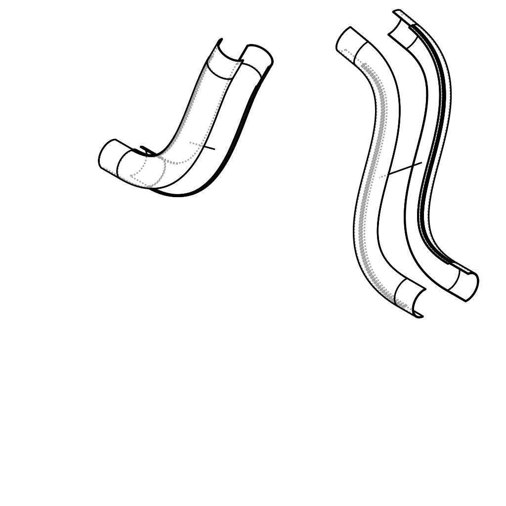

# Exhaust Manifolds

I got an [IE exhaust kit](http://ecstuning.com/b-integrated-engineering-parts/ie-b9-sq5-cat-back-exhaust-system/ieexcz1~int/?__cf_chl_tk=3.sM98lc3zO6.TljKxYxHSWbfedp2mBXP4KXyj35eUw-1776977950-1.0.1.1-Kr.Mao_o47HH8.Kwx2htw8uEozn_W59rgKzPN0KS9hY) for my car and after looking around, decided the best way to add some [exhaust tips](https://parts.audibethesda.com/p/Audi__SQ5/SQ5-Sport-Exhaust--Black/109131021/ZAW071897EDSP.html) to the kit and make it look nice was by creating some custom exhaust manifolds to connect the midpipe section of the kit to the pipes I got. I generated the manifolds in Jupyter Lab using mainly cadquery. 

I currently have version 3 of the manifolds (the initial commit) scheduled for construction at the supplier, and am maintaining their engineering feedback as github issues, which I plan to fix in the next version. The material is stainless steel. This stuff is provided totally as is and I have no plans of supporting it once I have a working build. 

## Files

There are two manifolds, driver and passenger. The manifolds are further separated into left and right sides and are reattached after printing using high temperature epoxy:



*Exploded assembly diagram.*

- **build.py** \- contains the project source.
- **exhaust\_manifolds.ipynb** \- contains examples of using the `Builder` class.
- **exhaust\_manifolds\_v{x}\_driver\_left.stl** \- the left side of the driver manifold.  
- **exhaust\_manifolds\_v{x}\_driver\_right.stl** \- the right side of the driver manifold.  
- **exhaust\_manifolds\_v{x}\_passenger\_left.stl** \- the left side of the passenger manifold.  
- **exhaust\_manifolds\_v{x}\_passenger\_right.stl** \- the right side of the passenger manifold.

## Getting Started

This project uses conda for dependency management. You can easily setup the build environment using these commands:
```
conda env create -f environment.yml
conda activate cq
```

## Building and Running

This will run unit tests, then update the current version of STL files checked into the repo:
```
pytest -qq build.py
python build.py
```

Prior to updating `build.py`, these commands should be run to ensure proper formatting:
```
ruff format build.py
ruff check build.py
```

There is a notebook showing usage examples named `exhaust_manifolds.ipynb`. I use the lab GUI to modify the notebook. Prior to committing, you should run nbstripout prior to pushing any changes to the notebook to make sure the notebook is free of artifacts.
