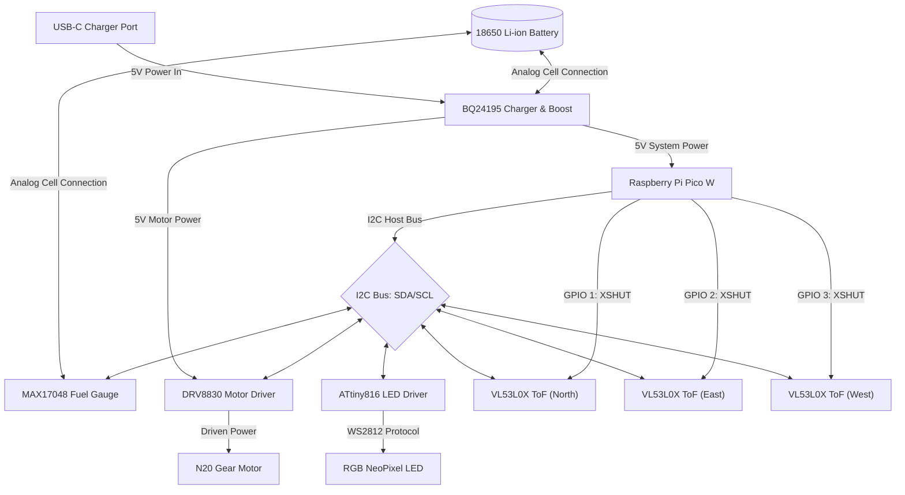

# Cat Fountain

This project designs a custom 3D-printable automatic pet cat water fountain. It features a bottom water bowl, a mechanical water spout, a vertical delivery tube, and a spout nozzle at the top to create a gentle flowing stream of water for cats. The complete design will incorporate an upper drinking level and enclosed 2L water storage tank, as well as a compartment for the motor controller.

The design utilizes precise build123d joint placement to ensure alignment of the impeller on the central shaft pin, and rigid mounting sockets for the water tube and spout nozzle.


*Exploded assembly diagram.*

## Build Files

After running `build.py`, you should see these files in your build output organized by project subdirectories:

- **build/cat_fountain/cat_fountain_diagram.svg** - An exploded assembly diagram of the cat fountain.
- **build/cat_fountain/bowl.stl** / **bowl.obj** - The main bottom water bowl.
- **build/cat_fountain/impeller.stl** / **impeller.obj** - The spinning impeller blades.
- **build/cat_fountain/tube.stl** / **tube.obj** - The vertical water delivery tube.
- **build/cat_fountain/spout.stl** / **spout.obj** - The water spout nozzle.
- **build/cat_fountain/fountain.stl** / **fountain.obj** - The compiled full assembly.
- **build/cat_fountain/product.urdf** - The URDF definition file for visualization/simulation.

## Visualization & Simulation

To view the cat fountain assembly in the CAD viewer:
```bash
python src/view.py cat_fountain/product
```

To run the physics simulation of the cat fountain in PyBullet:
```bash
python src/view.py cat_fountain/product:view/simulate -s 1000
```

## System Block Diagram



## Bill of Materials (BOM)

To build the cat fountain with I2C communication across all peripheral subsystems, here are the recommended components to purchase. All selected parts are highly standard in the electronics maker ecosystem (Adafruit, SparkFun, TI, Raspberry Pi).

| Component | Recommended Part | Description | I2C Address (Hex) | Key Features |
| :--- | :--- | :--- | :--- | :--- |
| **Microcontroller Board** | **Raspberry Pi Pico W** | Main controller running MicroPython/C++. Controls the I2C bus, reads sensors, and drives motor speed. | *Host Controller* | Dual ARM Cortex-M0+, built-in Wi-Fi/Bluetooth, two hardware I2C buses (I2C0, I2C1). |
| **IR Proximity Sensors (Qty: 3)** | **Adafruit VL53L0X Time-of-Flight (ToF)** | Long-range laser distance sensor used for cat proximity detection in North, East, and West directions. | `0x29` (default)<br>*Re-addressed to `0x30`, `0x31`, `0x32` at boot* | Measures precise distances up to 2m, unaffected by ambient light. Uses shutdown pin (XSHUT) for startup addressing. |
| **RGB LED Indicator** | **Adafruit NeoPixel Driver (ATtiny816)** | High-brightness status LED to indicate battery capacity and device state over I2C. | `0x60` | Interfaces standard WS2812B/NeoPixels to an I2C bus via a pre-programmed ATtiny microcontroller. |
| **USBC Charger & Boost** | **Adafruit BQ24195 Charger & Boost** | USB-C power management IC for charging the battery and boosting to 5V for the water pump motor. | `0x6B` | I2C-controlled charging rate, input current limits, and telemetry. Outputs stable 5.1V at up to 2.1A. |
| **Battery Fuel Gauge** | **Adafruit MAX17048 LiPo Fuel Gauge** | Battery monitor board to track cell voltage and state of charge (percentage) over I2C. | `0x36` | Uses ModelGauge algorithm for accurate state of charge without battery calibration. |
| **Battery** | **Standard 18650 3.7V Li-ion Cell** | Main energy source (e.g. Samsung 30Q or Panasonic NCR18650B, 3000+ mAh). | *N/A (Analog)* | Rechargeable lithium-ion cell to fit the internal battery storage area. |
| **DC Motor Driver** | **Grove - I2C Motor Driver (DRV8830)** | Low-voltage motor controller to drive and speed-regulate the N20 gear motor driving the Archimedes screw. | `0x60` to `0x65` (configurable via bridges) | H-Bridge driver with output voltage feedback for speed control, overcurrent protection. |
| **DC Motor** | **N20 Micro Metal Gear Motor (3V - 6V)** | High-torque micro geared DC motor to drive the Archimedes screw shaft. | *N/A (Driven by DRV8830)* | Operates at 3-6V (e.g. 50:1 or 100:1 ratio). Fits inside the dry motor compartment and mounts to the ceiling socket. |

### Technical Integration Notes

1. **Handling Multiple Proximity Sensors**:
   Since all three `VL53L0X` sensors share the same default I2C address (`0x29`), you must connect the `XSHUT` (shutdown) pin of each sensor to a separate GPIO pin on the Pico. At boot, pull all `XSHUT` pins LOW to disable the sensors. Then, enable them one by one (pull `XSHUT` HIGH) and send an I2C command to assign a unique address (`0x30`, `0x31`, `0x32`) to the active sensor.
2. **I2C Bus Voltage & Pull-Ups**:
   The Raspberry Pi Pico operates at 3.3V logic. Ensure all boards are powered at 3.3V (or have 3.3V level-shifting built-in). Add `4.7kΩ` pull-up resistors to the `SDA` and `SCL` lines of each active I2C bus.
3. **Motor Speed Control**:
   The DRV8830 driver allows adjusting the output voltage in 64 steps over I2C. This can be modulated depending on cat proximity to dynamically speed up the Archimedes screw pump when a cat approaches, and slow down or enter standby when idle.

### Fasteners & O-Rings

These fasteners and seal components are required to assemble the 3D-printed body parts and secure the mechanical and electrical sub-components:

| Component | Qty | Size/Spec | Use Case |
| :--- | :--- | :--- | :--- |
| **Lid Mounting Screws** | 4 | M3 x 10mm (Socket or Button Head) | Secures the top cover lid to the bowl tabs. Fits into the 3mm counterbores. |
| **Bottom Cover Screws** | 4 | M3 x 10mm (Flat Head/Countersunk) | Secures the controller compartment cover. Fits flush into the bottom countersinks. |
| **DC Motor Screws** | 2 | M2 x 4mm or 5mm (Machine Screws) | Secures the DC motor to the dry compartment ceiling mount (17mm spacing). |
| **Proximity Sensor Screws** | 6 | M2 x 6mm or 8mm (Self-Tapping or Machine) | Mounts the three proximity sensors to the North, East, and West walls. |
| **Charging Port Screws** | 2 | M2 x 6mm or 8mm (Self-Tapping or Machine) | Secures the USB-C charging port board to the back wall of the bowl. |
| **Shaft Seal O-Ring** | 1 | 4.5 mm to 5.0 mm ID x 1.5 mm CS (Nitrile/NBR) | Fits into the sealing groove under the impeller shaft to prevent water leaking into the dry motor compartment. |

## Battery Life Estimation

To maximize portable operation on a single **18650 3.7V Li-ion battery (3000 mAh / 11.1 Wh)**, the system implements a strict low-power duty cycle. Below is the power consumption breakdown and the firmware settings required to achieve an estimated **13.6 days of battery life**.

### Power Consumption Breakdown

| Subsystem State | Components Active | Current Draw (at 3.7V) | Power Draw | Daily Duty Cycle |
| :--- | :--- | :--- | :--- | :--- |
| **Active Mode** (Cat detected, pump running) | Pico W (active), DRV8830 + N20 Motor (70% speed), 3x VL53L0X (measuring), RGB LED (pulsing status) | **~248 mA** | 918 mW | **2.08%** (15 events/day, 2 mins each) |
| **Sleep Mode** (Idle, monitoring proximity) | Pico W (light sleep), DRV8830 (standby), 3x VL53L0X (shutdown), RGB LED (off) | **~4.1 mA** | 15 mW | **97.92%** (wakes up 50ms every 5s to poll) |

### Calculations
* **Average Daily Current Draw**: 
  $$I_{\text{avg}} = (I_{\text{active}} \times 0.0208) + (I_{\text{sleep}} \times 0.9792) = (248\text{ mA} \times 0.0208) + (4.1\text{ mA} \times 0.9792) = 5.16\text{ mA} + 4.01\text{ mA} = 9.17\text{ mA}$$
* **Estimated Runtime**:
  $$\text{Runtime} = \frac{3000\text{ mAh}}{9.17\text{ mA}} \approx 327\text{ hours} \approx \mathbf{13.6\text{ days}}$$

### Required Settings for Optimal Battery Life

To achieve this estimate, the firmware and hardware must be configured with the following power-saving settings:

1. **Microcontroller Sleep Management**:
   * The Raspberry Pi Pico W must disable the onboard Wi-Fi/Bluetooth chip (`cyw43_arch_gpio_put` to set the power pin LOW) when offline.
   * Put the RP2040 microcontroller into **light sleep mode** using a hardware timer (RTC) to wake up every **5.0 seconds** to poll for cat presence.
2. **Proximity Sensor Hardware Shutdown**:
   * Pull the `XSHUT` (shutdown) pins of all three `VL53L0X` sensors **LOW** when the Pico enters sleep. This forces the sensors into a hardware standby drawing only **$5\mu\text{A}$** each, instead of leaving them active at $20\text{ mA}$ each.
   * On wakeup, enable only one sensor at a time (pull `XSHUT` HIGH), take a single-shot measurement, and immediately disable it again.
3. **Motor Driver Standby State**:
   * When no cat is present, send an I2C command to write `0x00` (standby mode) to the DRV8830 register. This turns off the internal H-bridge bridge outputs completely, reducing standby current to less than $1\mu\text{A}$.
4. **Status LED Duty Cycling**:
   * The RGB NeoPixel status LED should remain **OFF** during sleep mode. For battery level indication, blink the LED briefly (e.g. 50ms pulse) once every 10 seconds rather than leaving it on continuously.
5. **I2C Bus Leakage Prevention**:
   * Ensure that the $4.7\text{ k}\Omega$ I2C pull-up resistors are tied to the Pico's $3.3\text{V}$ rail, so that when the Pico is in sleep mode, there is no leakage current flowing through the pull-up resistors to disabled peripheral pins.

