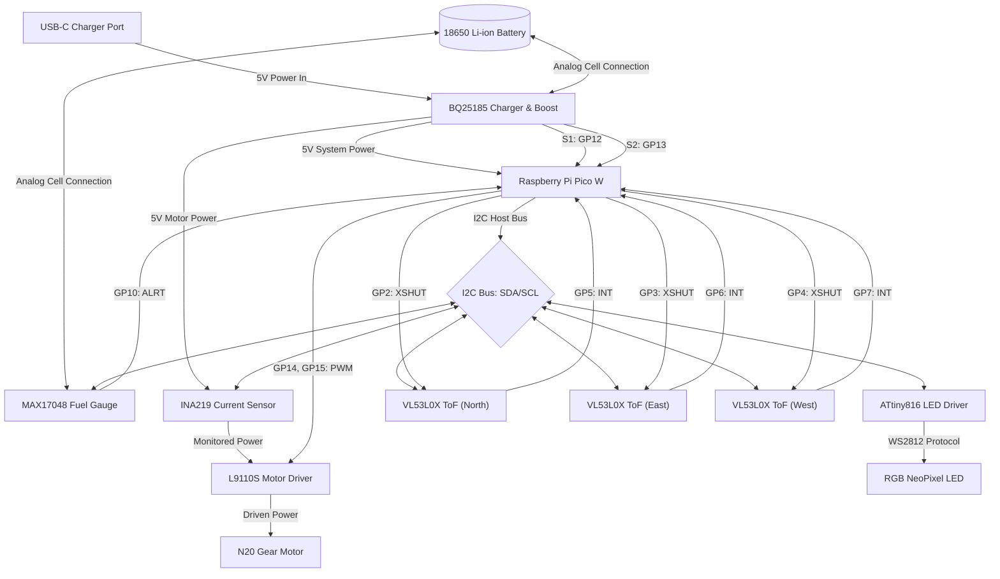

# Cat Fountain

This project designs a custom 3D-printable automatic pet cat water fountain. It features a bottom water bowl, a mechanical water spout, a vertical delivery tube, and a spout nozzle at the top to create a gentle flowing stream of water for cats. The complete design will incorporate an upper drinking level and enclosed 2L water storage tank, as well as a compartment for the motor controller.

The design utilizes precise build123d joint placement to ensure alignment of the impeller on the central shaft pin, and rigid mounting sockets for the water tube and spout nozzle.


*Exploded assembly diagram.*

## Build Files

After running `build.py`, you should see these files in your build output organized by subdirectories under the build folder:

- **build/svg/cat_fountain/cat_fountain_diagram.svg** - An exploded assembly diagram of the cat fountain.
- **build/stl/cat_fountain/bowl.stl** / **impeller.stl** / etc. - The 3D printable STL files (in standard millimeters scale).
- **build/obj/cat_fountain/bowl.obj** / **impeller.obj** / etc. - The 3D visual OBJ files (in standard meters scale).
- **build/urdf/cat_fountain/product.urdf** - The URDF definition file for visualization/simulation.

## Visualization & Simulation

To view the cat fountain assembly in the CAD viewer:
```bash
python src/view.py cat_fountain/product
```

To run the physics simulation of the cat fountain in PyBullet:
```bash
python src/view.py cat_fountain/product:view/simulate -s 1000
```

## System Block Diagram



## Bill of Materials (BOM)

To build the cat fountain with I2C communication across key monitoring subsystems (fuel gauge, current sensor, LED controller, proximity sensors), here are the recommended components to purchase. All selected parts are highly standard in the electronics maker ecosystem (Adafruit, SparkFun, TI, Raspberry Pi).

| Component | Recommended Part | Description | I2C Address (Hex) | Key Features |
| :--- | :--- | :--- | :--- | :--- |
| **Microcontroller Board** | **Raspberry Pi Pico W** | Main controller running MicroPython/C++. Controls the I2C bus, reads sensors, and drives motor speed. | *Host Controller* | Dual ARM Cortex-M0+, built-in Wi-Fi/Bluetooth, two hardware I2C buses (I2C0, I2C1). |
| **IR Proximity Sensors (Qty: 3)** | **Adafruit VL53L0X Time-of-Flight (ToF)** | Long-range laser distance sensor used for cat proximity detection in North, East, and West directions. | `0x29` (default)<br>*Re-addressed to `0x30`, `0x31`, `0x32` at boot* | Measures precise distances up to 2m, unaffected by ambient light. Uses shutdown pin (XSHUT) for startup addressing. |
| **RGB LED Indicator** | **Adafruit NeoPixel Driver (ATtiny816)** | High-brightness status LED to indicate battery capacity and device state over I2C. | `0x60` | Interfaces standard WS2812B/NeoPixels to an I2C bus via a pre-programmed ATtiny microcontroller. |
| **USBC Charger & Boost** | **Adafruit BQ25185 Charger & Boost (6106)** | USB-C power management IC for charging the battery and boosting to 5V for the water pump motor. | *N/A (Standalone)* | Standalone linear charger. Uses jumpers/resistors to configure chemistry/current. S1 (FAULT) & S2 (CHG) pads provide digital status to GP12/GP13. |
| **Battery Fuel Gauge** | **Adafruit MAX17048 LiPo Fuel Gauge** | Battery monitor board to track cell voltage and state of charge (percentage) over I2C. | `0x36` | Uses ModelGauge algorithm for accurate state of charge without battery calibration. Includes configurable alert interrupt (ALRT) pin connected to GP10. |
| **Battery** | **Standard 18650 3.7V Li-ion Cell** | Main energy source (e.g. Samsung 30Q or Panasonic NCR18650B, 3000+ mAh). | *N/A (Analog)* | Rechargeable lithium-ion cell to fit the internal battery storage area. |
| **DC Motor Driver** | **L9110S Dual-Channel H-Bridge** | Low-voltage motor driver to drive and speed-regulate the N20 gear motor. | *N/A (Driven by GPIO PWM)* | Dual H-bridge, support for 2.5V-12V motors, up to 800mA continuous. Controlled via GP14 and GP15. |
| **DC Motor** | **N20 Micro Metal Gear Motor (3V - 6V)** | High-torque micro geared DC motor to drive the Archimedes screw shaft. | *N/A (Driven by L9110S)* | Operates at 3-6V (e.g. 50:1 or 100:1 ratio). Fits inside the dry motor compartment and mounts to the ceiling socket. |
| **I2C Current Sensor** | [Adafruit INA219 Current Sensor](https://www.adafruit.com/product/904) | High-side current and power monitor to measure motor current draw and calculate load torque. | `0x40` | Measures current up to 3.2A with 1% accuracy. Used for low water / refill detection. |

### Technical Integration Notes

1. **Handling Multiple Proximity Sensors**:
   Since all three `VL53L0X` sensors share the same default I2C address (`0x29`), you must connect the `XSHUT` (shutdown) pin of each sensor to a separate GPIO pin on the Pico. At boot, pull all `XSHUT` pins LOW to disable the sensors. Then, enable them one by one (pull `XSHUT` HIGH) and send an I2C command to assign a unique address (`0x30`, `0x31`, `0x32`) to the active sensor.
2. **I2C Bus Voltage & Pull-Ups**:
   The Raspberry Pi Pico operates at 3.3V logic. Ensure all boards are powered at 3.3V (or have 3.3V level-shifting built-in). Add `4.7kΩ` pull-up resistors to the `SDA` and `SCL` lines of each active I2C bus.
3. **Motor Speed & Torque Control**:
   * The L9110S DC motor driver allows adjusting the motor speed via PWM (Pulse Width Modulation) driven directly by Pico GPIO pins `GP14` and `GP15` (forward/backward duty cycles). This can be modulated depending on cat proximity to dynamically speed up the Archimedes screw pump when a cat approaches, and slow down or enter standby when idle.
   * **Water Level / Refill Detection**: The INA219 current sensor measures motor current draw over I2C. When the water level in the bowl runs low, the impeller spins in air rather than water, causing motor load torque and current draw to drop significantly. The RP2040 can monitor this current drop over I2C, trigger a "low water" alert, and pulse the RGB NeoPixel status LED to notify the user.
4. **Debug SWD & UART Pins**:
   * **SWD Debugging**: The separate 3-pin debug header at the bottom edge of the Pico W provides **SWCLK**, **GND**, and **SWDIO** for hardware debugging (e.g., using a Raspberry Pi Debug Probe or Picoprobe). These do not occupy standard GPIO pins.
   * **UART Console / Printf Debugging**: **GP0 (TX)** and **GP1 (RX)** are reserved as the default debug UART0 port, leaving them completely free from control or sensor connections.
5. **Passive Battery Temperature Monitoring**:
   * The Adafruit BQ25185 board operates as a standalone charger without I2C control, and its /CE (Charge Enable) pin is hard-wired to GND, meaning the Pico W cannot programmatically disable charging.
   * To ensure battery safety inside the sealed dry electronics compartment, the BQ25185's built-in hardware temperature protection should be used: cut the TH trace jumper on the back of the board and connect a 10kΩ NTC thermistor (attached to the battery cell) between the TH pad and GND. This allows the BQ25185 to automatically suspend charging in hardware if the battery exceeds safe temperature limits.
   * The Pico W can passively monitor the internal ambient temperature of the electronics compartment using the RP2040's built-in internal temperature sensor (on ADC channel 4). If the temperature exceeds 45°C, the Pico W should enter a low-power sleep mode and cut power to the motor driver.
6. **Fuel Gauge Alert Interrupt**:
   * The active-low `ALRT` (Alert) pin of the MAX17048 fuel gauge is wired to Pico GPIO `GP10`. The firmware configures this pin with an internal pull-up and attaches an interrupt service routine (ISR). This enables the MAX17048 to asynchronously wake the microcontroller or trigger an interrupt on low-battery (e.g. State of Charge falls below 10%) or battery voltage alerts, rather than requiring the Pico W to constantly wake up to poll the fuel gauge, optimizing overall system power efficiency.
7. **Charger Status Monitoring**:
   * The status outputs S1 (FAULT/STAT1) and S2 (CHG/STAT2) are connected to Pico GPIOs GP12 and GP13 (configured as inputs with internal pull-ups).
   * The Pico W can decode the charging state using the following logic:
     - S1 = HIGH, S2 = LOW: Normal charging in progress.
     - S1 = HIGH, S2 = HIGH: Charging completed, standby, or input power disconnected.
     - S1 = LOW, S2 = HIGH: Recoverable fault (e.g. over-temperature).
     - S1 = LOW, S2 = LOW: Non-recoverable fault (e.g. 6-hour safety timer expired).
   * If a non-recoverable fault is detected (both S1 and S2 LOW), the user must cycle the input power (VIN) to reset the BQ25185's safety timer, as the hard-wired /CE pin cannot be toggled by the microcontroller.

### 3D-Printed Parts & Materials

The following parts are manufactured to form the physical structure and assembly of the cat fountain:

| Part Name | Qty | Recommended Material | Description / Use Case |
| :--- | :--- | :--- | :--- |
| **Bowl** | 1 | PETG (Food-Safe Coating) | The main water reservoir (2L capacity) and enclosure base. |
| **Lid** | 1 | PETG (Food-Safe Coating) | Top cover acting as a drinking shelf and stabilizing the delivery tube. |
| **Tube** | 1 | PETG (Food-Safe Coating) | Vertical water delivery tube feeding the drinking shelf. |
| **Impeller** | 1 | PETG (Food-Safe Coating) | The spinning Archimedes screw / vortex impeller pump. |
| **Drain Cover** | 1 | PETG (Food-Safe Coating) | Removable cover with locking tabs for the filter compartment. |
| **Bottom Cover** | 1 | PETG or PLA | Bottom enclosure cover protecting the electronics compartment. |
| **Sensor Cover** | 3 | UTR-8100 Translucent (SLA) | Translucent push-fit protective covers for the three proximity sensor ports. |
| **LED Cover** | 1 | UTR-8100 Translucent (SLA) | Translucent push-fit diffuser plug for the status RGB LED. |

> [!NOTE]
> **Manufacturing & Post-Processing Details**:
> 1. **Translucent Covers**: Since PCBWay does not offer transparent PETG, both the LED Cover and Sensor Covers should be SLA-printed using UTR-8100 translucent resin to ensure light/IR transparency.
> 2. **Food Safety Post-Processing**: Standard FDM 3D printed parts have micro-grooves that can harbor bacteria. All PETG components in contact with water (Bowl, Lid, Tube, Impeller, Drain Cover) must be coated with a food-grade epoxy (e.g., Max CLR or similar FDA-compliant epoxy coating) as a post-processing step before use.

### Fasteners & O-Rings

These fasteners and seal components are required to assemble the 3D-printed body parts and secure the mechanical and electrical sub-components:

| Component | Qty | Size/Spec | Use Case |
| :--- | :--- | :--- | :--- |
| **Lid Mounting Screws** | 4 | M3 x 10mm (Socket or Button Head) | Secures the top cover lid to the bowl tabs. Fits into the 3mm counterbores. |
| **Bottom Cover Screws** | 4 | M3 x 10mm (Flat Head/Countersunk) | Secures the controller compartment cover. Fits flush into the bottom countersinks. |
| **DC Motor Screws** | 2 | M2 x 4mm or 5mm (Machine Screws) | Secures the DC motor to the dry compartment ceiling mount (17mm spacing). |
| **Proximity Sensor Screws** | 6 | M2 x 6mm (Machine Screws) | Mounts the three proximity sensors to the internal bosses. |
| **Charger Board Screws** | 4 | M2 x 4mm or 5mm (Machine Screws) | Secures the Adafruit BQ25185 board to the dry compartment ceiling. |
| **Fuel Gauge Screws** | 2 | M2 x 4mm or 5mm (Machine Screws) | Secures the Adafruit MAX17048 board to the dry compartment ceiling. |
| **Pico W Screws** | 4 | M2 x 4mm or 5mm (Machine Screws) | Secures the Raspberry Pi Pico W to the dry compartment ceiling. |
| **Motor Driver Screws** | 2 | M2 x 4mm or 5mm (Machine Screws) | Secures the L9110S board to the dry compartment ceiling. |
| **Current Sensor Screws** | 2 | M2 x 4mm or 5mm (Machine Screws) | Secures the Adafruit INA219 board to the dry compartment ceiling. |
| **LED Controller Screws** | 4 | M2 x 4mm or 5mm (Machine Screws) | Secures the Adafruit NeoDriver LED board to the dry compartment ceiling. |
| **Shaft Seal O-Ring** | 1 | 4.5 mm to 5.0 mm ID x 1.5 mm CS (Nitrile/NBR) | Fits into the sealing groove under the impeller shaft to prevent water leaking into the dry motor compartment. |

## Battery Life Estimation

To maximize portable operation on a single **18650 3.7V Li-ion battery (3000 mAh / 11.1 Wh)**, the system implements a strict low-power duty cycle. Below is the power consumption breakdown and the firmware settings required to achieve an estimated **13.6 days of battery life**.

### Power Consumption Breakdown

| Subsystem State | Components Active | Current Draw (at 3.7V) | Power Draw | Daily Duty Cycle |
| :--- | :--- | :--- | :--- | :--- |
| **Active Mode** (Cat detected, pump running) | Pico W (active), L9110S + N20 Motor (70% speed), INA219 (measuring), 3x VL53L0X (measuring), RGB LED (pulsing status) | **~248 mA** | 918 mW | **2.08%** (15 events/day, 2 mins each) |
| **Sleep Mode** (Idle, monitoring proximity) | Pico W (light sleep), L9110S (disabled), INA219 (power-down), 3x VL53L0X (shutdown), RGB LED (off) | **~4.1 mA** | 15 mW | **97.92%** (wakes up 50ms every 5s to poll) |

### Calculations
* **Average Daily Current Draw**: 
  $$I_{\text{avg}} = (I_{\text{active}} \times 0.0208) + (I_{\text{sleep}} \times 0.9792) = (248\text{ mA} \times 0.0208) + (4.1\text{ mA} \times 0.9792) = 5.16\text{ mA} + 4.01\text{ mA} = 9.17\text{ mA}$$
* **Estimated Runtime**:
  $$\text{Runtime} = \frac{3000\text{ mAh}}{9.17\text{ mA}} \approx 327\text{ hours} \approx \mathbf{13.6\text{ days}}$$

### Required Settings for Optimal Battery Life

To achieve this estimate, the firmware and hardware must be configured with the following power-saving settings:

1. **Microcontroller Sleep Management**:
   * The Raspberry Pi Pico W must disable the onboard Wi-Fi/Bluetooth chip (`cyw43_arch_gpio_put` to set the power pin LOW) when offline.
   * Put the RP2040 microcontroller into **light sleep mode** using a hardware timer (RTC) to wake up every **5.0 seconds** to poll for cat presence.
2. **Proximity Sensor Hardware Shutdown**:
   * Pull the `XSHUT` (shutdown) pins of all three `VL53L0X` sensors **LOW** when the Pico enters sleep. This forces the sensors into a hardware standby drawing only **$5\mu\text{A}$** each, instead of leaving them active at $20\text{ mA}$ each.
   * On wakeup, enable only one sensor at a time (pull `XSHUT` HIGH), take a single-shot measurement, and immediately disable it again.
3. **Motor Driver & Current Sensor Standby State**:
   * When no cat is present, pull both L9110S input control pins (`GP14` and `GP15`) **LOW** to disable the H-bridge and completely cut off motor current draw (standby current < 1µA).
   * Put the INA219 current sensor into **power-down mode** over I2C to reduce its standby current to just 15µA.
   * Wake up the INA219 only when active pumping is triggered.
4. **Status LED Duty Cycling**:
   * The RGB NeoPixel status LED should remain **OFF** during sleep mode. For battery level indication, blink the LED briefly (e.g. 50ms pulse) once every 10 seconds rather than leaving it on continuously.
5. **Asynchronous Battery Monitoring**:
   * By utilizing the MAX17048 `ALRT` hardware interrupt wired to `GP10`, the Pico W avoids waking up periodically to poll the battery state of charge over I2C. The microcontroller can remain in a low-power state and receive battery alerts asynchronously.


