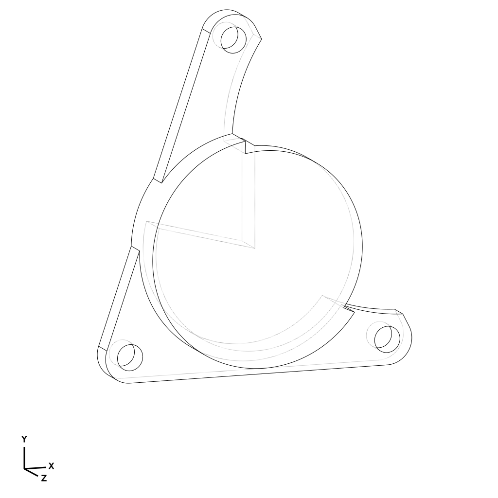

# Valve Actuator Limiter

This project addresses issues where exhaust valve actuators rotate beyond their intended range when [aftermarket exhaust components](exhaust_manifolds.md) are installed. The limiter plate provides a mechanical stop to prevent diagnostic trouble codes (DTCs) and dashboard warning lights.

The design features a lightweight aluminum or stainless steel plate that mounts between the actuator and the mounting bracket, restricting the sweep of the actuator arm to the OEM specification. Compatible with Audi 2025 SQ5.



*Wire diagram.*

## Releases

- **V5** Initial release for testing fitment on standard valve actuators.

## Build Files

After running `build.py`, you should see these files in your build output:

- **build/stl/valve_actuator_limiter/limiter_plate.stl** - The limiter plate with a 90deg wedge offset.
- **build/svg/valve_actuator_limiter/valve_actuator_limiter_diagram.svg** - The limiter plate diagram.

## Visualization

To view the limiter plate in the CAD viewer:
```bash
python src/view.py valve_actuator_limiter/limiter_plate
```
